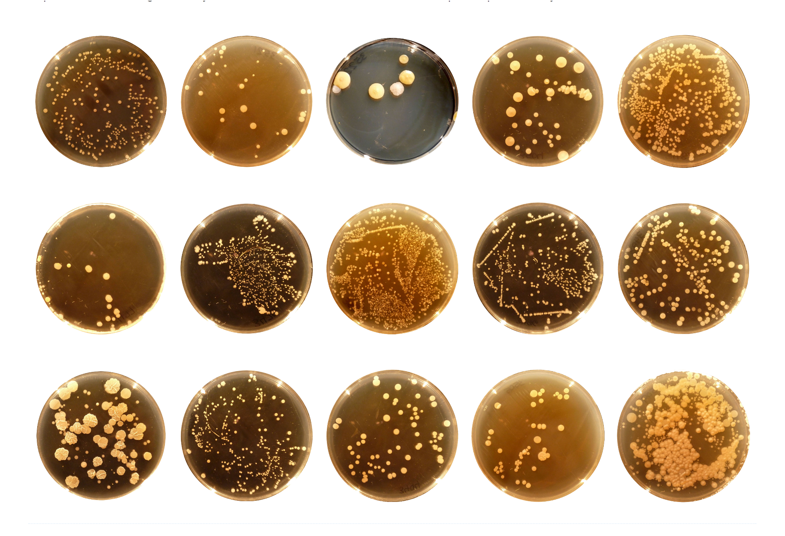

### belly-button-challenge
# Belly Button Biodiversity Visulatization
 
(Image captured from https://robdunnlab.com/projects/belly-button-biodiversity/)*
## Interactive Visualization
The task for this challenge is to use the D3 library with plotly.js and html to build an interactive dashboard to explore the [Belly Button Biodiversity dataset](http://robdunnlab.com/projects/belly-button-biodiversity/). This dataset catalogs the microbes that colonize human navels and reveals that a small handful of microbial species (also called operational taxonomic units, or OTUs, in the study) were present in more than 70% of people, while the rest were relatively rare.  
We use the D3 library to read in samples.json from this [URL](https://static.bc-edx.com/data/dl-1-2/m14/lms/starter/samples.json), then build our app using javascript with plotly.js, then deploy our app to the free static page hosting service provided by GitHub Pages.
## References
Hulcr, J. et al. (2012) A Jungle in There: Bacteria in Belly Buttons are Highly Diverse, but Predictable. Retrieved from: http://robdunnlab.com/projects/belly-button-biodiversity/results-and-data/Links to an external site.
